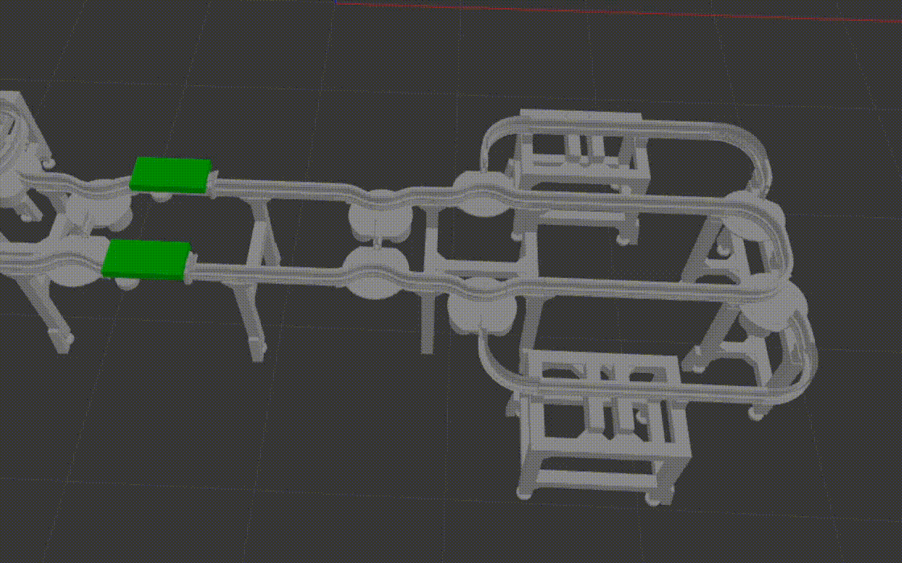

# projet-integration-sri-2022-2023
Projet d'intégration ROS SRI 2022 2023

# Organization:

[Planification de tâches]()

[Perception]()

[Saisie](sri_tiago_pick): Cédérick Mouliets

[Simulation](aip_gazebo) 

[Navigation](navigation/README.md): Hakim Cherfi & Jeremy Santene

[Multitiago](aip_multitiago/README.md): Rémi Delauzun & Raphaël Bizet

Plannification de mouvement

# Demos

## Simulations

### Monde simple
Lancer une simulation simple dans groix_porquerolles.world : 
- Dans un terminal dans la racine du projet, lancer :

```bash
source ./devel/setup.bash
roslaunch aip_gazebo aip_gazebo.launch
```

### Simulation cellule + navette
Lancer une simulation de la cellule flexible de la salle groix_porquerolles avec une navette montée sur les rails.

- Avant de lancer, assurez vous d'avoir le package ros effort_controllers :
```bash
rospack find effort_controllers
```
Pour installer le package sous ros melodic :
```bash
sudo apt-get ros-melodic-ros-control ros-melodic-ros-controllers
```

- Pour lancer la simulation, dans un terminal dans la racine du projet, lancer :
```bash
source ./devel/setup.bash
roslaunch aip_gazebo shuttle_only.launch
```

- Pour lancer les les controllers et ainsi creer les topics, lancer :
```bash
roslaunch aip_gazebo shuttle_controllers.launch
```

- Pour visualiser les topics crées par la simulation, lancer :
```bash
rostopic list
```
resultat attendu :
```bash
...
/my_shuttle/joint1_vel_controller/command
/my_shuttle/joint2_vel_controller/command
/my_shuttle2/joint1_vel_controller/command
/my_shuttle2/joint2_vel_controller/command
...
```

- Pour controller la navette1 de cette simulation entrez la commande suivante :
```bash
#Pour controller la navette 1 à une vitesse de 1.7 :
rostopic pub /my_shuttle/joint1_vel_controller/command std_msgs/Float64 "data: -1.7"
rostopic pub /my_shuttle/joint2_vel_controller/command std_msgs/Float64 "data:  1.7"
```

- Resultat attendu : 




	
### Saisie
Lancer une opération de saisie dans la simulation :
- Dans un 2eme terminal dans la racine du projet, lancer les noeuds ROS :
```bash
source ./devel/setup.bash
roslaunch sri_tiago_pick pick_demo.launch
```

- Dans un 3eme terminal dans la racine du projet, lancer le service pick :
```bash
source ./devel/setup.bash
rosservice call /pick_gui
```
[Illustrations du pick](sri_tiago_pick/screenshots) 

### Navigation

À la racine du projet, sourcer ```devel/setup.bash``` et lancer la commande

``` code
roslaunch navigation aip_tiago_mapping.launch
```

Ceci permet de créer une carte de la salle porquerolles en faisant naviguer le robot (simulation).

Demo de la navigation dans le ```navigation/README.md```.


### Multitiago

Dans un terminal dans la racine du projet, lancer :

```bash
source ./devel/setup.bash
roslaunch multitiago multi_aip_gazebo.launch
```
Lancement d'une simulation de deux robots tiago dans la salle groix-porquerolle.


